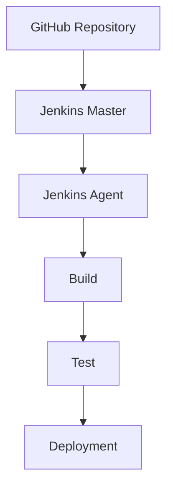

# ⚙️ CodeAlpha Jenkins Remoting Project

<p align="center">


</p>

---

# 🚀 Jenkins Remoting Project

This repository contains my solution for **Task 2 – Jenkins Remoting** completed during the **CodeAlpha DevOps Internship**.

The project demonstrates how to configure a Jenkins Master with remote build agents using Docker, Docker Compose, SSH authentication, and Jenkins Configuration as Code (JCasC).

---

# 📖 Table of Contents

- Project Overview
- Objectives
- Features
- Technologies
- Project Structure
- Architecture
- Prerequisites
- Installation
- Configuration
- Running the Project
- Jenkins Pipeline
- Jenkins Agent
- Docker Compose
- Security
- Troubleshooting
- Future Improvements
- Learning Outcomes
- Author
- License

---

# 📌 Project Overview

The objective of this project is to understand distributed build systems using Jenkins Remoting.

The project includes:

- Jenkins Master
- Jenkins Agent
- Docker Containers
- Docker Compose
- Jenkins Configuration as Code
- SSH Authentication
- Pipeline as Code

---

# 🎯 Objectives

- Configure Jenkins Master
- Configure Jenkins Agent
- Connect Agent using SSH
- Execute builds remotely
- Distribute workloads
- Learn Jenkins Pipeline
- Learn Docker Networking
- Practice DevOps Automation

---

# ✨ Features

✔ Jenkins Master

✔ Jenkins Agent

✔ Docker Deployment

✔ Docker Compose

✔ Remote Builds

✔ SSH Authentication

✔ Pipeline as Code

✔ Jenkins Configuration as Code

✔ Scalable Build Environment

---

# 🛠 Technologies Used

- Jenkins
- Docker
- Docker Compose
- Java
- Git
- GitHub
- Linux
- SSH
- Jenkins Configuration as Code (JCasC)

---

# 📂 Project Structure

```text
CodeAlpha_JenkinsRemoting/

│
├── Jenkinsfile
├── docker-compose.yml
├── Dockerfile
├── jenkins.yaml
├── ssh/
├── scripts/
├── README.md
└── screenshots/
```

---

# 🏗 Architecture

```text
                +----------------------+
                |     GitHub Repo      |
                +----------+-----------+
                           |
                           |
                           ▼
                 +------------------+
                 | Jenkins Master   |
                 +---------+--------+
                           |
                 SSH Connection
                           |
                           ▼
                 +------------------+
                 | Jenkins Agent    |
                 +---------+--------+
                           |
                           ▼
                 Build Execution
```

---

# 🔄 Workflow



---

# ⚙ Prerequisites

Before starting, install:

- Docker
- Docker Compose
- Git
- Java JDK 17
- Jenkins

---

# 🚀 Installation

Clone repository

```bash
git clone https://github.com/YOUR_USERNAME/CodeAlpha_JenkinsRemoting.git
```

Open folder

```bash
cd CodeAlpha_JenkinsRemoting
```

---

# 🐳 Start Containers

```bash
docker-compose up -d
```

Verify

```bash
docker ps
```

---

# 🔐 Configure SSH

Generate SSH key

```bash
ssh-keygen -t rsa
```

Copy public key

```bash
ssh-copy-id user@agent-ip
```

Verify connection

```bash
ssh user@agent-ip
```

---

# ⚙ Configure Jenkins Agent

1. Open Jenkins Dashboard

2. Manage Jenkins

3. Nodes

4. New Node

5. Permanent Agent

6. Configure SSH Launcher

7. Save

---

# 📄 Jenkinsfile

The pipeline performs:

- Source Code Checkout
- Build
- Testing
- Packaging
- Deployment

Example

```groovy
pipeline {

    agent any

    stages {

        stage('Build') {

            steps {

                echo 'Building project...'

            }

        }

        stage('Test') {

            steps {

                echo 'Running tests...'

            }

        }

    }

}
```

---

# 🐳 Docker Compose

Run

```bash
docker-compose up
```

Stop

```bash
docker-compose down
```

Restart

```bash
docker-compose restart
```

---

# 🔒 Security Best Practices

- Never expose Jenkins to the Internet without authentication.

- Use SSH Keys instead of passwords.

- Enable HTTPS.

- Store secrets using Jenkins Credentials.

- Restrict Agent permissions.

---

# 📷 Screenshots

Recommended screenshots:

- Jenkins Dashboard

- Running Pipeline

- Connected Agent

- Docker Containers

- Successful Build

---

# 🧪 Testing

Run pipeline

Verify

- Build Success

- Agent Connected

- Pipeline Completed

---

# 🛠 Troubleshooting

## Agent Offline

Restart Agent

```bash
docker restart agent
```

---

## Jenkins Container

Restart

```bash
docker restart jenkins
```

---

## View Logs

```bash
docker logs jenkins
```

---

# 📈 Future Improvements

- Kubernetes Agent

- SonarQube

- Nexus Repository

- Terraform

- Azure DevOps Integration

- Prometheus Monitoring

- Grafana Dashboard

- Slack Notifications

---

# 🎓 Learning Outcomes

During this project I learned

- Jenkins Administration

- Jenkins Remoting

- Docker

- Docker Compose

- SSH Authentication

- Distributed Builds

- Pipeline Automation

- CI/CD Concepts

- DevOps Best Practices

---

# 🤝 Contribution

Contributions are welcome.

Fork this repository.

Create your feature branch.

Commit your changes.

Push your branch.

Open a Pull Request.

---

# 👨‍💻 Author

## Khalid Ag Mohamed Aly

**DevOps Intern — CodeAlpha**

AI & Political Science Student

GitHub

https://github.com/kmohamed20

LinkedIn

https://linkedin.com/in/khalidagmohamedaly

---

# 🙏 Acknowledgements

Special thanks to **CodeAlpha** for providing this internship opportunity and practical exposure to DevOps tools and modern software delivery practices.

---

# 📜 License

MIT License

Copyright © 2026 Khalid Ag Mohamed Aly

---

⭐ If you found this project useful, please consider giving it a star.
